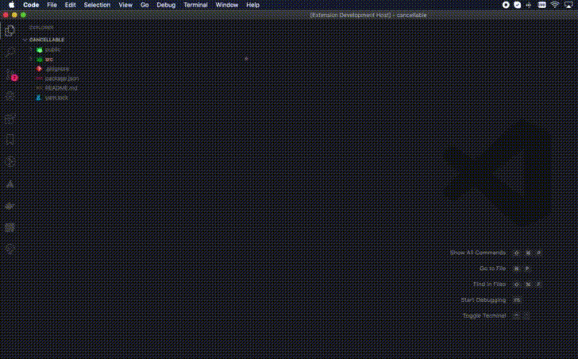

# file-vault

Quickly grab your favorite files -- from Github!

## Requirements

Before downloading files you need to specify the sources, which are the repository URLs. For that, either open `Settings > File Vault > Repositories` or include a key named `fileVault.repositories`, which is an array of strings.

## Usage

Just right click in any folder on the file explorer and select `Download files from vault`. After that, choose the desired repository, the files and you're done! The files should have been downloaded to the target folder, like in the example below:

## Troubleshooting

If you find any issues, please copy what was thrown in the output tab on the `File Vault` task.
After copying, please file an issue with general information about your environment, like:

- OS
- VSCode version
- Desired repository and files selected

## License

MIT

### Rights

bank vault icon PNG Designed By IYIKON from <a href="https://pngtree.com/">Pngtree.com</a>
